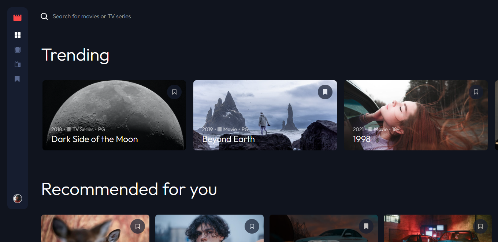
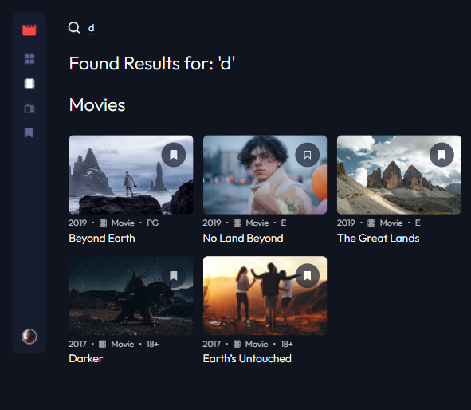
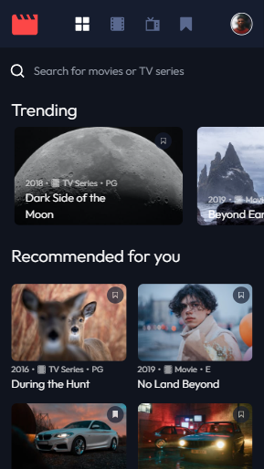

# Entertainment Web App

## Checkout The Live Project: [HERE!](https://entertainment-app-xi.vercel.app/)

## Table of contents

- [Overview](#overview)
  - [The challenge](#the-challenge)
  - [Screenshot](#screenshot)
  - [Links](#links)
- [My process](#my-process)
  - [Built with](#built-with)
  - [What I learned](#what-i-learned)
  - [Continued development](#continued-development)
  - [Useful resources](#useful-resources)
- [Author](#author)
- [Acknowledgments](#acknowledgments)

## Overview

### The challenge

Users should be able to:

- View the optimal layout for the app depending on their device's screen size
- See hover states for all interactive elements on the page
- Navigate between Home, Movies, TV Series, and Bookmarked Shows pages
- Add/Remove bookmarks from all movies and TV series
- Search for relevant shows on all pages

### Screenshot

## My process

### Built with

- Flexbox
- CSS Grid
- Mobile-first workflow
- [React](https://reactjs.org/) - JS library
- [Next.js](https://nextjs.org/) - React framework
- [Node.js](https://nodejs.org/en/) -JS Runtime
- [Tailwind CSS](https://tailwindcss.com/) - CSS Framework

### What I learned

- Collaboration utilizing a best practise GIT workflow
- Working with Next.js
- Using React Props to pass data between components
- Working with local JSON data to populate components while designing the app
- Configuring different hover and click effects using State

### Continued development

This project really helped me gain a better understanding of working with props in React and creating reusable components.

### Useful resources

- [React - Components and Props](https://reactjs.org/docs/components-and-props.html)

## Author

- Website - [Tyrell Curry](https://tyrellcurry.io)

## Acknowledgments

Special thanks to [Rodderick Garland](https://github.com/zencoder24) for collaborating on the project.
